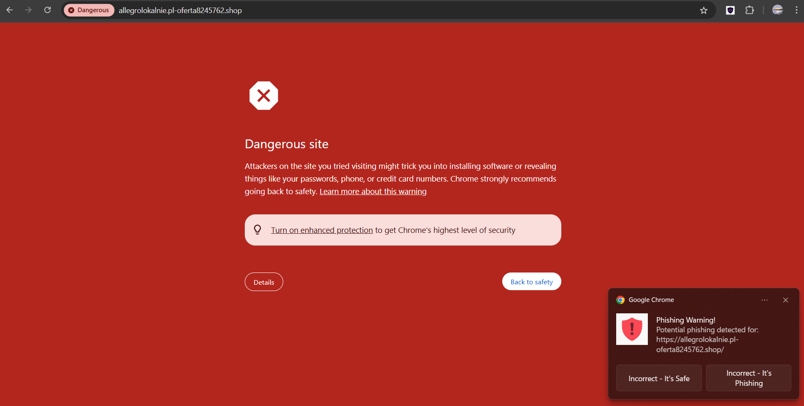
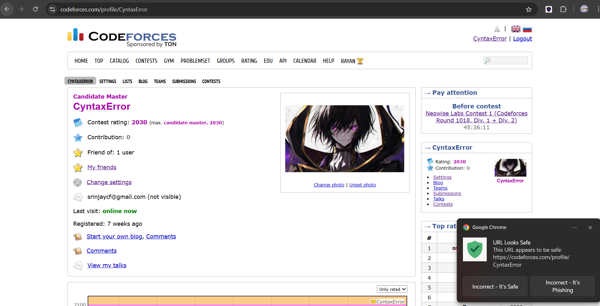

# PhishNet - Phishing Detection System

**Built by Srinjay Panja**

## Introduction

PhishNet is a system designed to detect phishing URLs in real-time. It utilizes a machine learning model (URLSet Ensemble) trained on URL characteristics, combined with a backend API and a browser extension for seamless integration. When you browse the web, the extension sends the current URL to the backend API, which uses the trained model to predict whether the URL is likely malicious (phishing) or legitimate.

---

## 🚀 Live Deployment & Easy Usage

**PhishNet is already deployed and ready to use!**

- The backend is live at: [https://phishnet-pavv.onrender.com](https://phishnet-pavv.onrender.com)
- Anyone can use the PhishNet browser extension from anywhere — no server setup required!

> **Note:** Because of the free Render plan, the backend will "spin down" after a period of inactivity. The first request after a period of inactivity can be delayed by 50 seconds or more while the server wakes up. Subsequent requests will be fast.

### How to Use
1. **Install the Extension:**
    - Download **just the `extension` folder** from this repository (no need to clone the entire repo).
    - Open your browser's extensions page (e.g., `chrome://extensions` for Chrome).
    - Enable Developer Mode.
    - Click "Load unpacked" and select the `extension` folder you downloaded.
2. **Browse the Web:**
    - The extension will automatically check URLs using the live backend.
    - You’ll see notifications if a site is flagged as phishing.

---

This project consists of three main components:
1.  **Backend:** A FastAPI application that serves the ML model predictions via an API endpoint.
2.  **Machine Learning (URLSet Ensemble):** A model trained using features extracted from the `urlset.csv` dataset. The training scripts and related assets are included.
3.  **Browser Extension:** A simple browser extension that communicates with the backend API to check URLs as you visit them.

## Features

*   Real-time URL analysis via browser extension.
*   Phishing detection powered by an ensemble of 4 machine learning models: Random Forest, Logistic Regression, Decision Tree, and Gradient Boosting.
*   FastAPI backend for efficient API request handling.
*   Modular structure with separate components for the backend, ML training, and extension.
*   Includes scripts for data preprocessing and model retraining.

## Project Structure

```
PhishNet/
├── backend/                  # FastAPI backend application
│   ├── ml_assets/            # (Contains assets for other models - not used by default)
│   ├── traditional_ml_assets/ # (Contains assets for other models - not used by default)
│   ├── urlset_ml_assets/     # Model assets (scaler, columns, model) - NOT in repo, see below
│   ├── .env.example          # Example environment file for MongoDB URI
│   ├── feature_extraction.py # Feature extraction logic for prediction
│   ├── main.py               # FastAPI application entry point
│   └── requirements.txt      # Backend Python dependencies
├── backend_env/              # (Ignored) Virtual environment for backend
├── data/                     # (Ignored) Datasets
├── extension/                # Browser extension files
│   ├── icons/                # Extension icons
│   ├── background.js         # Extension logic
│   └── manifest.json         # Extension configuration
├── ml_training/              # Scripts for ML model training
│   ├── feature_extraction.py # Feature extraction logic for training
│   ├── preprocess_urlset.py  # Preprocessing script for urlset.csv
│   ├── train_urlset.py       # Training script for the URLSet model
│   └── requirements.txt      # ML training Python dependencies
├── ml_training_env/          # (Ignored) Virtual environment for ML training
├── README.md                 # This file
└── ...                       # Other configuration/installer files
```

**Note:** Virtual environments, large binary/model/data files, and sensitive assets are not stored in the repository. See below for how to obtain required model files.

## Setup Instructions

> **Note:** Manual backend installation and local MongoDB setup are NOT required. The backend is already deployed and ready to use. Most users only need to install the extension as described above.

If you want to deploy your own backend or retrain the model, see the Render deployment and ML training instructions below.

## Training the Model (Optional)

If you want to retrain the URLSet ensemble model using the provided data or your own data:

1.  Ensure you have completed the **ML Training Setup** steps (virtual environment activated, dependencies installed).
2.  Navigate to the ML training directory: `cd path/to/PhishNet/ml_training`
3.  Run the training script:
    ```bash
    python train_urlset.py
    ```
    *   This script will typically perform preprocessing (using `preprocess_urlset.py` and `feature_extraction.py`) on the `data/urlset.csv` file and then train the ensemble model.
4.  **Copy Assets:** After successful training, new model assets will likely be generated within the `ml_training` directory (or a subdirectory). You need to manually copy the updated assets (e.g., `urlset_ensemble_model.pkl`, `scaler.pkl`, `feature_columns.pkl`, `processed_data.pkl`) to the `backend/urlset_ml_assets/` directory, overwriting the existing files.
5.  Restart the backend server for the changes to take effect.

---

## Demo

Below are screenshots demonstrating PhishNet in action:

**Phishing detected (extension warning):**



**Phishing but Chrome Secure can't detect:**


**Safe site detected:**



---

## License

MIT License  

Copyright 2025 Srinjay Panja

Permission is hereby granted, free of charge, to any person obtaining a copy of this software and associated documentation files (the “Software”), to deal in the Software without restriction, including without limitation the rights to use, copy, modify, merge, publish, distribute, sublicense, and/or sell copies of the Software, and to permit persons to whom the Software is furnished to do so, subject to the following conditions:

The above copyright notice and this permission notice shall be included in all copies or substantial portions of the Software.

THE SOFTWARE IS PROVIDED “AS IS”, WITHOUT WARRANTY OF ANY KIND, EXPRESS OR IMPLIED, INCLUDING BUT NOT LIMITED TO THE WARRANTIES OF MERCHANTABILITY, FITNESS FOR A PARTICULAR PURPOSE AND NONINFRINGEMENT. IN NO EVENT SHALL THE AUTHORS OR COPYRIGHT HOLDERS BE LIABLE FOR ANY CLAIM, DAMAGES OR OTHER LIABILITY, WHETHER IN AN ACTION OF CONTRACT, TORT OR OTHERWISE, ARISING FROM, OUT OF OR IN CONNECTION WITH THE SOFTWARE OR THE USE OR OTHER DEALINGS IN THE SOFTWARE.

---

## Notes on Large Files & LFS

- This repository does **not** store model/data files or virtual environments. These are ignored via `.gitignore`.
- **GitHub hard-limits files to 100 MB, even with Git LFS.**
- Model files are distributed via cloud storage and must be downloaded as described above.
