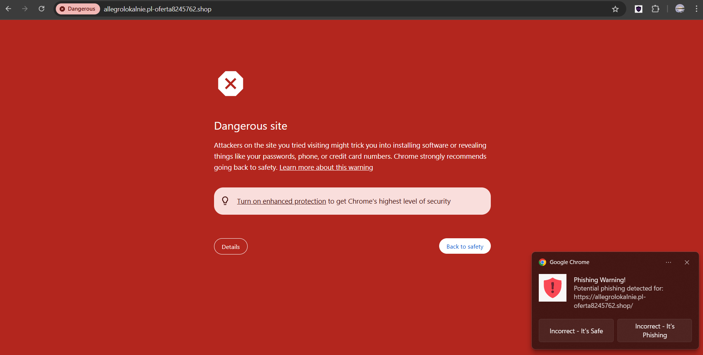
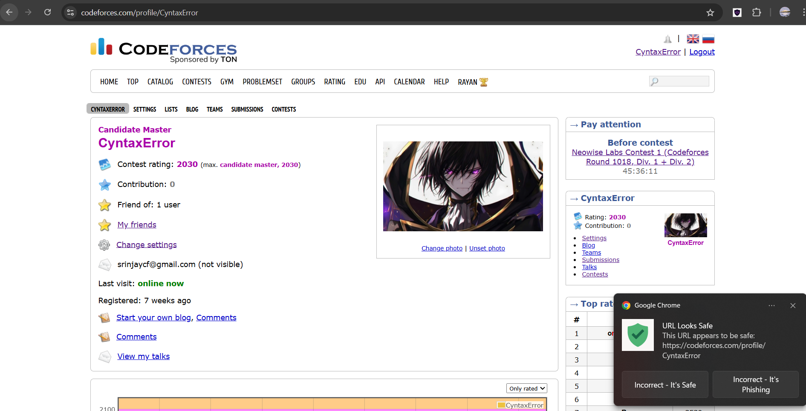

# PhishNet - Phishing Detection System

**Built by Srinjay Panja**

## Introduction

PhishNet is a system designed to detect phishing URLs in real-time. It utilizes a machine learning model (URLSet Ensemble) trained on URL characteristics, combined with a backend API and a browser extension for seamless integration. When you browse the web, the extension sends the current URL to the backend API, which uses the trained model to predict whether the URL is likely malicious (phishing) or legitimate.

---

## 🚀 Live Deployment & Easy Usage

**PhishNet is already deployed and ready to use!**

- The backend is live at: [https://phishnet-pavv.onrender.com](https://phishnet-pavv.onrender.com)
- Anyone can use the PhishNet browser extension from anywhere — no server setup required!

> **Note:** Because of the free Render plan, the backend will "spin down" after a period of inactivity. The first request after a period of inactivity can be delayed by 50 seconds or more while the server wakes up. Subsequent requests will be fast.

### How to Use
1. **Install the Extension:**
    - Download **just the `extension` folder** from this repository (no need to clone the entire repo) or click on this to download directly: [https://downgit.github.io/#/home?url=https://github.com/Bucke200/PhishNet/tree/master/extension](https://downgit.github.io/#/home?url=https://github.com/Bucke200/PhishNet/tree/master/extension).
    - Open your browser's extensions page (e.g., `chrome://extensions` for Chrome).
    - Enable Developer Mode.
    - Click "Load unpacked" and select the `extension` folder you downloaded.
2. **Browse the Web:**
    - The extension will automatically check URLs using the live backend.
    - You’ll see notifications if a site is flagged as phishing.

---

This project consists of three main components:
1.  **Backend:** A FastAPI application that serves the ML model predictions via an API endpoint.
2.  **Machine Learning (URLSet Ensemble):** A model trained using features extracted from the `urlset.csv` dataset (dataset not shipped with the repo; see Training the Model). The training scripts are included.
3.  **Browser Extension:** A simple browser extension that communicates with the backend API to check URLs as you visit them.

## Features

*   Real-time URL analysis via browser extension.
*   Phishing detection powered by an ensemble of 4 machine learning models: Random Forest, Logistic Regression, Decision Tree, and Gradient Boosting.
*   FastAPI backend for efficient API request handling.
*   Modular structure with separate components for the backend, ML training, and extension.
*   Includes scripts for data preprocessing and model retraining.

## Project Structure

```
PhishNet/
├── .github/workflows/          # ci.yml (pytest + mypy), collect.yml (daily feeds), eval.yml (PR gate)
├── backend/                    # Deployment layout
│   ├── urlset_ml_assets/       # (Ignored) Fetched/generated model assets
│   ├── .env.example            # Example environment file for MongoDB URI
│   └── Dockerfile              # Backend image (uv-based; build from repo root)
├── dist/                       # (Ignored) Build output
├── extension/                  # Browser extension files
│   ├── icons/                  # Extension icons
│   ├── background.js           # Extension logic
│   └── manifest.json           # Extension configuration
├── img/                        # Demo screenshots
├── ml_training/                # Scripts for ML model training
│   ├── __init__.py             # Package marker (importable in tests)
│   ├── preprocess_urlset.py    # Preprocessing script for urlset.csv
│   └── train_urlset.py         # Training script for the URLSet model
├── src/phishnet/               # Canonical packaged app
│   ├── features/extraction.py  # Canonical feature extractor
│   ├── api.py                  # FastAPI application
│   ├── verified_download.py    # SHA256-verified model-artifact downloader
│   ├── model_manifest.json     # Artifact names, URLs, and hashes
│   └── urlset_ml_assets/       # (Ignored *.pkl) Runtime model assets + README
├── tests/                      # pytest suite (features, wiring, downloads)
├── collect.py                  # Phase 1: append-only daily feed snapshot -> data/raw/
├── build_splits.py             # Phase 1: temporal + domain-disjoint splits -> data/splits/
├── eval.py                     # Phase 1: harness, any .score(urls) predictor in, fixed report out
├── predictors.py               # Phase 1: legacy ensemble adapter + leak canaries
├── test_eval.py                # Phase 1: tests for silent metric edge cases
├── Makefile                    # Phase 1 targets: report/collect/split/baseline/eval/canary/test
├── data/                       # (Ignored) raw log (raw/) + generated splits (splits/)
├── reports/                    # Generated evaluation reports (<tag>.json + <tag>.md)
├── .dockerignore               # Root-context Docker ignores
├── pyproject.toml              # Exact deps; pytest/ruff/mypy config
├── uv.lock                     # Locked dependency set (CI uses --locked)
├── README.md                   # This file
└── update.md                   # Local status notes
```

**Note:** Virtual environments, datasets, model binaries, and secrets are not stored in the repository (see `.gitignore`). Model files are fetched at deploy time — see Model Artifacts below.

## Model Artifacts (Not in Git)

Runtime model files (`urlset_ensemble_model.pkl`, `scaler.pkl`, `feature_columns.pkl`) are deployment artifacts and are never committed (git-ignored; GitHub also caps files at 100 MB).

*   **Run/deploy:** fetch and SHA256-verify them from the `models-v1` GitHub Release (sources and hashes are pinned in `src/phishnet/model_manifest.json`):
    ```bash
    uv sync
    uv run python -m phishnet.verified_download
    ```
    The backend resolves the asset directory via `$PHISHNET_ML_ASSETS_DIR` (the Docker image sets it to `/app/backend/urlset_ml_assets`), falling back to `src/phishnet/urlset_ml_assets/`.
*   **Retrain:** see Training the Model below; it writes fresh assets to `backend/urlset_ml_assets/`.

## Setup Instructions

> **Note:** Manual backend installation and local MongoDB setup are NOT required. The backend is already deployed and ready to use. Most users only need to install the extension as described above.

### Development (tests, types, CI)

Requires Python `>=3.10` and `uv`. From the repository root:

```bash
uv sync --locked   # locked deps, incl. dev tools
uv run pytest      # test suite (tests/)
uv run mypy src tests ml_training   # strict type-check
```

GitHub Actions runs the same three steps on every push and pull request (`.github/workflows/ci.yml`).

### Deploying Your Own Backend

Build the image from the repository root (a `backend/`-only context cannot see the root dependency files):

```bash
docker build -f backend/Dockerfile -t phishnet-backend .
```

The container fetches verified model artifacts on start (see Model Artifacts above) and serves `phishnet.api` on port 8000.

## Training the Model (Optional)

Retraining needs a dataset the repo does not ship: put a `urlset.csv` with `domain` and `label` columns at `data/urlset.csv` (`data/` is git-ignored).

1.  Install dependencies from the repository root (`pyproject.toml` + `uv.lock` are the source of truth, no separate virtual-environment setup needed):
    ```bash
    uv sync
    ```
2.  From the repository root, preprocess then train (paths used by the scripts, e.g. `data/...` and `backend/...`, are resolved relative to the repository root, so run them from there rather than from `ml_training/`):
    ```bash
    uv run python ml_training/preprocess_urlset.py
    uv run python ml_training/train_urlset.py
    ```
    *   Preprocessing (single canonical extractor via `phishnet.features.extraction`) writes `processed_data.pkl`, `scaler.pkl`, and `feature_columns.pkl` to `backend/urlset_ml_assets/` (see the `*_FILE` constants at the top of each script).
    *   Training loads those files and writes `urlset_ensemble_model.pkl` alongside them (it runs on import, so plain `python` execution is enough).
3.  Point the app at the fresh assets with `$PHISHNET_ML_ASSETS_DIR` (e.g. `backend/urlset_ml_assets/`) or restart the deployed backend to pick them up.

---

## Evaluation Harness (Phase 1)

Everything after this phase is judged by one command:

```bash
make report        # rebuild splits from the raw log, re-run the frozen baseline
```

### Layout

| File | What it does |
|---|---|
| `collect.py` | Append-only daily snapshot of phishing feeds and Tranco deep links → `data/raw/` |
| `build_splits.py` | Temporal + domain-disjoint splits, campaign capping, leakage audit → `data/splits/` |
| `eval.py` | The harness. Any `.score(urls)` predictor in, one fixed report out → `reports/` |
| `predictors.py` | Legacy ensemble adapter + the canaries that check the dataset |
| `test_eval.py` | Tests for the metric edge cases that fail silently |
| `Makefile` | `report/collect/split/baseline/eval/canary/test/clean` targets |
| `.github/workflows/collect.yml` | Daily cron snapshotting feeds into `data/raw/` (start on day 1) |
| `.github/workflows/eval.yml` | PR gate evaluating the candidate model against `reports/baseline.json` |

### Order of operations

**Day 1 — start the cron before anything else.** The OpenPhish community feed has
no timestamps; it is a snapshot of what is live right now. The first-observed date
comes from the collection log (`.github/workflows/collect.yml`). PhishTank's
`online-valid` dump carries `submission_time`, so it backfills real dates
immediately — request an app key on day 1 (approval is not instant).

> Pushing anything under `.github/workflows/` needs a token with the `workflow`
> scope. If the file silently does not appear in the repo, that is why.

**Days 1–2 — benign side.** Pin a Tranco list ID from <https://tranco-list.eu>
(the permanent ID, not "top 1M as of today"). `collect.py --benign` crawls each
domain's homepage for same-registrable-domain internal links and keeps at most one
bare homepage per domain.

**Days 3–4 — splits and audit.** `make split` prints the shrinkage at every stage
and ends with the leakage audit. Treat a `LEAKING` verdict as a hard stop.

**Day 5 — freeze the baseline.** `make baseline` writes `reports/baseline.json`.
Commit it. It will be a bad number. That is the point — it is the denominator for
every later claim.

**Days 6–7 — wire the gate.** `make canary` should show `random` landing near the
base rate and `url_shape_canary` doing poorly. If the canary does well, go back to
day 3.

### Methodology (frozen, do not change)

*   **PR-AUC as the headline** (`average_precision_score`, not trapezoid AUC).
*   **Recall at FPR ≤ 0.5%**, with the threshold reported (walk real score values;
    ties respected, no ROC interpolation).
*   **Precision at deployment prevalence** (default 1e-4) + false warnings per
    10,000 URLs browsed.
*   **Bootstrap CIs resampled by registrable domain**, not by row.
*   **Straddling domains dropped from test, not train**; campaign cap (5 URLs per
    domain in test); pinned public suffix list with the source recorded in the
    manifest; distinct-score-count check (flags predictors with < 10 levels —
    the hard-voting `VotingClassifier` baseline is measured via member vote
    fractions and is expected to trip this flag).

### Adding a predictor

```python
class MyModel:
    name = "lgbm-v3"
    def score(self, urls: list[str]) -> list[float]:
        return self.model.predict_proba(featurise(urls))[:, 1].tolist()
```

```bash
make eval PRED=mymodule:MyModel
```

---

## Demo

Below are screenshots demonstrating PhishNet in action:

**Phishing detected (extension warning):**



**Phishing but Chrome Secure can't detect:**


**Safe site detected:**



---

## License

MIT License  

Copyright 2025 Srinjay Panja

Permission is hereby granted, free of charge, to any person obtaining a copy of this software and associated documentation files (the “Software”), to deal in the Software without restriction, including without limitation the rights to use, copy, modify, merge, publish, distribute, sublicense, and/or sell copies of the Software, and to permit persons to whom the Software is furnished to do so, subject to the following conditions:

The above copyright notice and this permission notice shall be included in all copies or substantial portions of the Software.

THE SOFTWARE IS PROVIDED “AS IS”, WITHOUT WARRANTY OF ANY KIND, EXPRESS OR IMPLIED, INCLUDING BUT NOT LIMITED TO THE WARRANTIES OF MERCHANTABILITY, FITNESS FOR A PARTICULAR PURPOSE AND NONINFRINGEMENT. IN NO EVENT SHALL THE AUTHORS OR COPYRIGHT HOLDERS BE LIABLE FOR ANY CLAIM, DAMAGES OR OTHER LIABILITY, WHETHER IN AN ACTION OF CONTRACT, TORT OR OTHERWISE, ARISING FROM, OUT OF OR IN CONNECTION WITH THE SOFTWARE OR THE USE OR OTHER DEALINGS IN THE SOFTWARE.

---

## Notes on Large Files

- This repository does **not** store model/data files or virtual environments. These are ignored via `.gitignore` (see Model Artifacts above for how to obtain them).
- `.gitattributes` still declares LFS filters for `*.pkl` and similar, but nothing in the repo uses LFS: binaries ship as GitHub Release assets, never via git.
