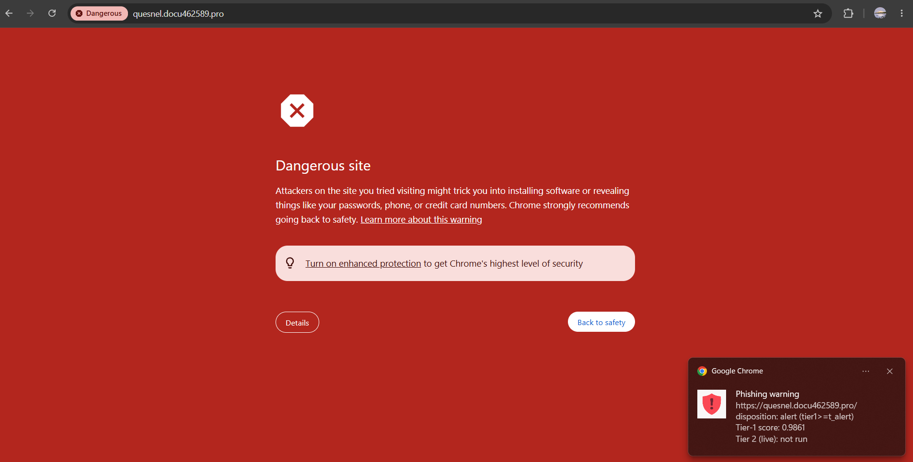
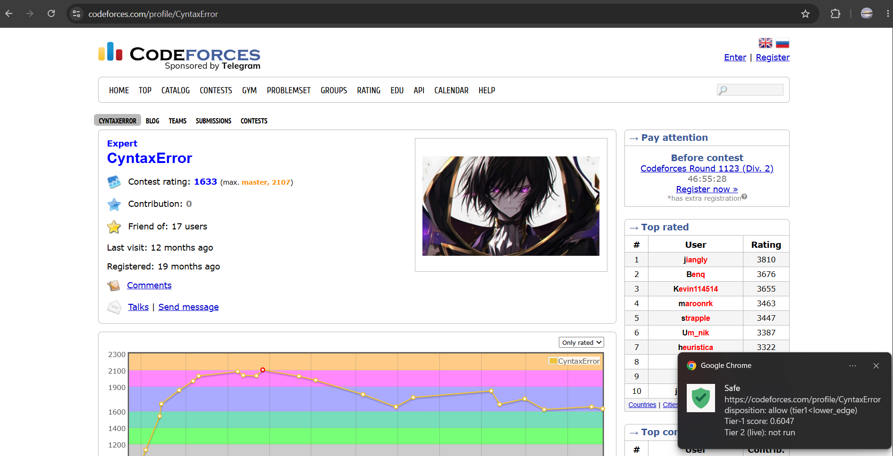
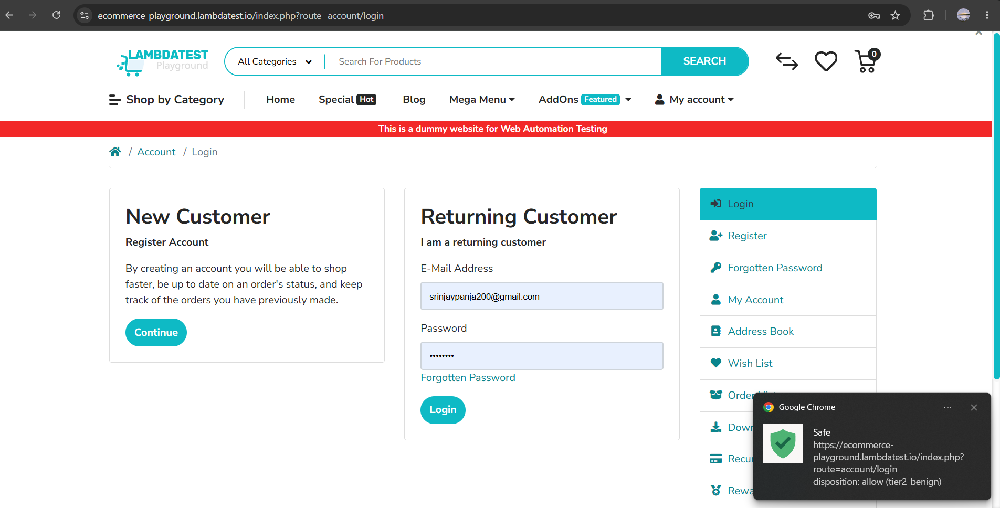

# PhishNet - Phishing URL detection

[](https://github.com/Bucke200/PhishNet/actions/workflows/ci.yml)
[](https://github.com/Bucke200/PhishNet/actions/workflows/repro.yml)
[](https://phishnet-serving-mz5maa3blq-uc.a.run.app/health)
[](pyproject.toml)
[](README.md#license)

**Built by Srinjay Panja**

Live in production: every browsed URL gets a verdict in single-digit
milliseconds (Tier-1 p50 0.45 ms in-process, ~7 ms over HTTP), suspicious
pages get a full headless-browser render plus an LLM judgment, and the whole
thing runs at $0/month on Cloud Run's free tier. Load the unpacked
`extension/` in Chrome, point it at the live backend above — no local setup.

## What this is

PhishNet is a phishing-URL detector with a browser extension, a FastAPI
serving container, and — more importantly — an evaluation pipeline that
records what works, what does not, and what it refuses to claim.

The champion is a single LightGBM over lexical URL features plus one hosting
signal (`is_hosted_tenant`), trained on a temporal, domain-disjoint split. It
does **not** use WHOIS/age at serving (ineligible: it failed its own
contamination gate), and it is **not** retrained between phases — every number
below is attached to the same frozen weights (`ablation_lexical_gbm_model.pkl`,
SHA256-pinned in `src/phishnet/model_manifest.json`).

Serving is a two-stage cascade: Tier 1 scores every URL string; rows in the
band (`0.6493 ≤ score < 0.9269`) go to Tier 2 (a hardened LLM page judgment
plus a frozen injection detector), and any Tier-2 failure **alerts** (fail
closed).

### Results at a glance (fixed thresholds, never swept)

| what | number | note |
|---|---|---|
| Recall @ 0.5% FPR (`t_alert` = 0.9269) | **50.4%** (achieved FPR 0.40%) | indistinguishable from the budget |
| Recall @ 1.0% FPR (`t_1pct` = 0.8781) | **60.7%** (achieved FPR 0.98%) | indistinguishable |
| Cold start, row (b), age forced unknown | **53.4%** | losing age costs ~25pp vs the age-known mix |
| Tier-1 serving latency p50 | **0.45 ms** in-process / ~7 ms HTTP | criterion 12 met (was 14.3 ms) |
| Phase 4 LLM layer | **unanswered** (bounded) | structural ceiling +0.0347 recall at most |
| Webflow-class hosted phishing | **missed** | recorded, retrain work (`docs/production-gaps.md` §8) |

Swept-on-test numbers appear only where labeled unattainable. The protocol is
`docs/phase3-preregistration.md`; results are `reports/phase3.md`,
`reports/phase5-adversarial.md`, and `reports/phase6.md`; the model card is
`docs/model-card.md`.

---

## Quickstart

Live production backend (no local setup needed):

```text
https://phishnet-serving-mz5maa3blq-uc.a.run.app
```

Load the extension (`chrome://extensions` → Developer mode → **Load
unpacked** → `extension/`), open its Options page, paste the URL above as
the Backend Base URL, and **Save & Test Connection**. Cloud Run free tier,
live Tier 2 with the `mechanism` failure policy (verified end-to-end:
Tier-1 bit-equal, Tier-2 LLM verdicts).

To run locally instead, start a serving container and point the extension
at `http://localhost:8000`:

1. **Start the container** (sealed demo mode — offline, replays the registered
   Phase 5 verdicts):
    ```bash
    docker build -f backend/Dockerfile -t phishnet-serving .
    docker run --rm -p 8000:8000 phishnet-serving
    ```
2. **Point the extension** at `http://localhost:8000` in its Options page
   (**Save & Test Connection**).
3. **Browse.** The notification shows the disposition (`alert` / `allow` /
   `can't assess`), the Tier-1 score, and the top SHAP features. `allow` means
   "no alert at the calibrated operating point" — not a safety guarantee.

For live Tier-2 (real page fetch + LLM judgment) instead of the sealed replay,
run the two-layer stack:

```bash
cp backend/.env.example .env     # put GROQ_API_KEY in .env
docker compose up --build
```

Out-of-band rows never call Tier 2, so ordinary browsing costs nothing beyond
the local score. `PHISHNET_TIER2_MODE=live` is fail-loud: if the key or
fetcher URL is missing, the container refuses to start rather than silently
serving "can't assess" for every in-band URL.

## Features

*   Real-time URL analysis via the browser extension, with native LightGBM SHAP
    explanations.
*   Two-stage cascade: a calibrated lexical champion, then an LLM page judgment
    with a frozen injection detector for in-band rows only.
*   Fail-closed Tier-2: a schema/refusal/timeout/unfetchable outcome alerts
    rather than silently retaining a score.
*   Shortener resolution: follows redirects and scores the final URL;
    unresolved → "can't assess", never a verdict score.
*   Reproducible: SHA256-pinned weights, frozen thresholds, sealed run stores,
    and a golden dataset-identity test suite.

## Tech stack

**Machine learning**

| Tool | Role |
|---|---|
| LightGBM 4.6 | The served champion (Phase 3 row (a)): one gradient-boosted tree model over 79 URL features; native tree-SHAP via `pred_contrib` |
| scikit-learn 1.6 | Legacy 4-model hard-vote ensemble (Random Forest, Logistic Regression, Decision Tree, Gradient Boosting), calibration (isotonic/sigmoid), metrics |
| pandas / NumPy | Feature tables, splits, report rendering |
| tldextract 5.1 | Registrable-domain parsing on a **pinned public-suffix snapshot** (no network at runtime) |
| python-Levenshtein | Brand-distance features (`*_min_distance`) |
| pyarrow | Parquet reader for the Common Crawl wave fetch |

**Serving and API**

| Tool | Role |
|---|---|
| FastAPI + Uvicorn | `GET /health`, `POST /predict`, `POST /explain` |
| Pydantic v2 | Request/response validation (and URL normalization) |
| Docker / Docker Compose | Slim Tier-1 image + a **separate Playwright fetcher image**, so latency is not measured beside a browser |
| LightGBM native SHAP | Per-feature contributions in the `/explain` response |

**LLM layer (Tier 2, in-band rows only)**

| Tool | Role |
|---|---|
| Groq API — `openai/gpt-oss-120b` | Strict JSON-schema page judgment (`temperature 0`, `seed 0`, `reasoning_effort low`) |
| Playwright (Chromium) | Renders the page in the fetcher image (`backend/fetcher/Dockerfile`) |
| BeautifulSoup 4 | HTML → frozen canonical extract (title, visible text, form fields, link hosts) |

**Data pipeline**

| Tool | Role |
|---|---|
| PhishTank `online-valid` + OpenPhish | Phishing feeds (temporal labels; takedown-filtered before collection) |
| Tranco 46VQX 1M | Benign seed domains (pinned, citable list ID) |
| Common Crawl `CC-MAIN-2026-34` (fallback `-30`) | Benign deep-link corpus |
| **AWS Athena + AWS Glue Data Catalog + Amazon S3** | Per-domain queries against the Common Crawl columnar index at `s3://commoncrawl/cc-index/table/cc-main/warc/`; the `ccindex` database/table/partitions live in the Glue Data Catalog; results are written to an S3 bucket |
| boto3 | Athena client (fetch-only, imported lazily so the locked runtime stays minimal) |
| RDAP / WHOIS | Domain-age enrichment (point-in-time; ineligible for the headline) |
| crt.sh | Certificate-transparency history (dropped unmeasured, Amendment E) |

**Tooling and CI**

| Tool | Role |
|---|---|
| uv + hatchling | Locked dependency resolution and packaging |
| ruff + mypy | Lint/format and strict typing |
| pytest | 570 tests, including golden dataset-identity and serving-identity gates |
| GitHub Actions | `ci`, `repro`, `eval`, `collect`, `phase4-forward` workflows |

> The Athena table is defined in the **AWS Glue Data Catalog** (Athena's
> catalog); the IAM policy at `docs/aws-athena-iam-policy.json` grants the
> Glue catalog actions plus S3 read on `commoncrawl` and write to a results
> bucket. No Glue crawler or ETL job is run — only the catalog Athena
> requires.

## Architecture

```text
extension ──POST /predict──► phishnet.serving (FastAPI)
                               │
                               ├─ shortener? resolve → score final URL
                               ▼
                         Tier 1 (LightGBM fast path)   p50 0.45 ms
                               │
                    ┌──────────┼───────────┐
                < 0.6493    in band     ≥ 0.9269
                  allow        │          alert
                               ▼
                         Tier 2 (LLM + detector, fail closed)
                         sealed (offline) │ live (Playwright + Groq)
```

Full diagram with latency/cost annotations: `docs/architecture.md`.

Vocabulary: `row (a)` = the served champion (Phase-3 lexical LightGBM, 79
columns); `p5-h1` = frozen Phase-5 prompt arm replayed by sealed Tier-2;
`p6-v1` = live prompt + widened response schema; `R6` = serving detector fix
(line-anchored `system-marker`); `T2-9` = risk-graded fail-closed floor for
Tier-2 failures.

## Data pipeline

```text
PhishTank / OpenPhish ─┐
                       ├─► data/raw/*.jsonl (append-only daily snapshots)
Tranco 46VQX ──────────┘        │
                                ▼
Common Crawl index ──► AWS Athena (S3) ──► build_cc_benign.py ──► validate_cc_benign.py
 (CC-MAIN-2026-34)      per-domain query      fetch + select        hard mechanism gates
                                │
                                ▼
                        build_splits.py ──► data/splits-p3/{train,calib,test}.csv
                        (temporal phish,        │  + leakage / shape audit
                         domain-hash benign)    ▼
                                        RDAP/WHOIS enrichment (point-in-time)
                                                │
                                                ▼
                        ml_training/train_ablation.py ──► backend/ablation_lexical_assets/
                                                │
                                                ▼
                        eval.py + predictors.py ──► reports/*.json|md
                                                │
                                                ▼
                        src/phishnet/serving (FastAPI) ──► extension/
```

| Stage | Entry point | Notes |
|---|---|---|
| Collect | `collect.py` (`collect.yml`) | PhishTank needs an app key; OpenPhish is key-free; Tranco via API key |
| Benign corpus | `build_cc_benign.py` | Common Crawl columnar index via Athena (`--source columnar`, default) or CDX probe; Parquet wave path (`fetch_cc_wave.py`) |
| Validate | `validate_cc_benign.py` | Scheme-gap, path-depth, length-inversion, overlap gates; never trains |
| Split | `build_splits.py` | Temporal cutoff for phishing, registrable-domain hash for benign; no per-URL random splitting |
| Enrich | `src/phishnet/enrichment/` | RDAP age + point-in-time join; CT dropped |
| Train | `ml_training/train_ablation.py` | Phase 3 row (a)/(b) ablations; `train_gbm.py`, `calibrate_gbm.py` for the Phase 2 lineage |
| Evaluate | `eval.py`, `predictors.py` | Fixed report; any `.score(urls)` predictor |
| Serve | `src/phishnet/serving/` | Tier-1 → Tier-2 cascade, shortener resolution, fail-closed |
| Harden | `src/phishnet/adversarial/`, `scripts/p5_*.py` | Injection detector + adversarial evaluation (Phase 5) |

> The Common Crawl benign acquisition **has been run end to end** — first full
> fetch + select on 2026-09-15. The Athena columnar query wrote to the S3
> results bucket and produced the pinned 12,000-row corpus
> (`data/raw/benign-cc-CC-MAIN-2026-34-2026-09-15.jsonl`), which passed the
> gate battery and was promoted to `data/splits-cc/`. See
> `docs/cc-benign-acquisition.md`.

## Project structure

```text
PhishNet/
├── .github/workflows/          # ci, repro, eval, collect, phase4-forward
├── backend/
│   ├── Dockerfile              # Tier-1 serving image (uv-based; build from repo root)
│   └── fetcher/                # Separate Playwright fetcher image (live Tier 2)
├── extension/                  # Manifest V3 browser extension
├── ml_training/                # Training, ablation, and calibration scripts
├── docs/                       # preregistrations (phases 3-7), model card, audits, runbooks
├── repro/                      # hashes.json + verify.py + check_golden.py
├── src/phishnet/               # Canonical packaged app
│   ├── features/extraction.py  # Canonical feature extractor
│   ├── serving/                # Tier-1 fast path, cascade, shortener, app
│   ├── fetcher/                # Playwright fetcher service (live Tier 2)
│   ├── llm/                    # Prompts + response schemas (p4-v1/p5-h1/p6-v1) + Groq client
│   ├── snapshot/               # Fetch/extract/join, eval-mode Tier-1 reference
│   ├── enrichment/             # RDAP age + point-in-time join (CT dropped)
│   ├── adversarial/            # Phase 5 injection detector + lexical transforms
│   ├── verified_download.py    # SHA256-verified model-artifact downloader
│   └── model_manifest.json     # Artifact names, URLs, and hashes
├── tests/                      # pytest suite (serving identity, cascade, schema, dataset identity, ...)
├── collect.py                  # Append-only daily feed snapshot -> data/raw/
├── build_splits.py             # Temporal + domain-disjoint splits -> data/splits/
├── build_cc_benign.py          # Common Crawl benign corpus (Athena columnar / CDX probe)
├── validate_cc_benign.py       # Corpus + trial-split gates
├── eval.py                     # Harness: any .score(urls) predictor in, fixed report out
├── predictors.py               # Predictor adapters + canaries + native SHAP
├── Makefile                    # report/collect/split/baseline/eval/canary/test/clean
├── docker-compose.yml          # Live two-layer stack (fetcher + serving)
├── pyproject.toml              # Exact deps; pytest/ruff/mypy config
└── uv.lock                     # Locked dependency set (CI uses --locked)
```

`data/`, model binaries, and secrets are not stored in the repository.

## Configuration

| Variable | Default | Purpose |
|---|---|---|
| `PHISHNET_TIER2_MODE` | `sealed` | Tier-2 provider: `sealed` (offline replay), `live` (fetch + Groq), `disabled` |
| `PHISHNET_TIER2_FLOOR` | `0.6493` | Score at/above which Tier 2 runs (testing knob; registered value is `lower_edge`) |
| `PHISHNET_TIER2_FAILURE_POLICY` | `closed` | Disposition for an unfetchable in-band page: `closed` (any failure alerts), `graded` (alert only if Tier-1 ≥ `PHISHNET_TIER2_FAILURE_FLOOR`), `mechanism` (dispose by failure type — `http_403`/`blocked` alert across the band; `dns`/`refused`/`tls` ≥ 0.70; `origin_timeout` ≥ 0.80; `http_404`/internal RPC → `can't assess`) |
| `PHISHNET_TIER2_FAILURE_FLOOR` | unset | Only used when `PHISHNET_TIER2_FAILURE_POLICY=graded` |
| `PHISHNET_FETCHER_URL` | — | Fetcher endpoint for live mode (e.g. `http://fetcher:8100/fetch`) |
| `GROQ_API_KEY` | — | Required by live mode; also read from `.env` |
| `PHISHNET_EXTENSION_ID` | pinned ID | CORS allowlist for the browser extension |
| `PHISHNET_ML_ASSETS_DIR` | packaged `urlset_ml_assets/` | Where the verified model artifacts live (`/app/models` in the image) |
| `PHISHNET_THRESHOLDS_FILE` | `reports/phase4.json` | Threshold source, verified at startup |
| `PHISHNET_MODELS_BASE_URL` | release URL | Mirror for `verified_download` (SHA256 still enforced) |
| `TLDEXTRACT_CACHE` | `.tld_cache` | Pinned public-suffix snapshot location |
| `TRANCO_API_KEY`, `TRANCO_ACCOUNT_EMAIL` | — | Tranco list resolution in `collect.py` |
| `PHISHTANK_KEY` | — | PhishTank feed pull in `collect.yml` |
| `AWS_PROFILE`, `AWS_REGION` | — | boto3 credentials/region for the Common Crawl Athena fetch |
| `ATHENA_OUTPUT` (Makefile) | `s3://phishnet-athena/hosted/` | Athena query-results bucket |

## API

```bash
# score + disposition (Tier 1 always; Tier 2 only for in-band rows)
curl -X POST localhost:8000/predict -H 'Content-Type: application/json' \
  -d '{"url": "https://example.com/login"}'

# native LightGBM SHAP for the scoring model (the old 501 is gone)
curl -X POST localhost:8000/explain -H 'Content-Type: application/json' \
  -d '{"url": "https://example.com/login", "top_k": 5}'

curl localhost:8000/health
```

Against production, replace `localhost:8000` with
`https://phishnet-serving-mz5maa3blq-uc.a.run.app`.

`/predict` returns `disposition` (`alert` / `allow` / `can't assess`), `score`
(the verdict score, `null` when unresolved), `tier1_score`, `in_band`,
`reason`, `tier2_mode` (`sealed` / `live` / `disabled`), `tier2` (the judgment
or failure), and the `model_hash` / `thresholds_source` provenance. `/explain`
returns top-k native tree-SHAP `{feature, contribution}` plus the `bias` term,
from the model that scored. `/health` reports the pinned hashes, thresholds,
and Tier-2 mode.

## Production

Live on **Google Cloud Run** (free tier, `$0.00/mo` at <1% of quota for
~9k URLs/mo) as two scale-to-zero services — full plan in
`docs/deployment-plan.md`:

| Service | Image | Size | Concurrency | Role |
|---|---|---|---|---|
| `phishnet-serving` | `backend/Dockerfile` | 512 MiB / 1 vCPU | 80 | Tier-1 LightGBM fast path + cascade |
| `phishnet-fetcher` | `backend/fetcher/Dockerfile` | 1.5 GiB / 1 vCPU | 10 | Tier-2 Playwright Chromium sandbox |

*   **Model baking:** row-(a) weights are downloaded and SHA256-verified in a
    `RUN` build step into `/app/models`, so containers boot with zero network
    I/O — cold starts stay <800 ms and `Tier1Servable` only re-verifies hashes
    in-memory (<2 ms).
*   **Browser tuning:** Chromium launches with memory-constrained flags
    (`--no-sandbox --disable-dev-shm-usage --disable-gpu --no-zygote
    --single-process`, single source of truth `CHROMIUM_ARGS` in
    `src/phishnet/fetcher/app.py`), ~350–500 MB RSS per worker.
*   **Budgets:** origin fetch 8 s, provider→fetcher RPC 25 s; Groq spend guard
    (`src/phishnet/llm/budget.py`) fails closed, and an unwritable ledger
    maps to a `Tier2Outcome("failure", ...)` instead of a 500.
*   **Secrets:** `GROQ_API_KEY` lives in Secret Manager (`groq-api-key`),
    mounted via `--set-secrets` — never in the image or the repo.
*   **Deploy:** `PROJECT_ID=… REGION=… GROQ_API_KEY=gsk_… ./deploy/deploy_cloudrun.sh`
    (idempotent: registry → build/push → secret → fetcher → serving), then
    `SERVING_URL=… ./deploy/smoke.sh` checks `/health`, `/predict`, `/explain`.
    Declarative fallbacks in `deploy/cloudrun/*.yaml`.

## Evaluation

`eval.py` takes any predictor with `.name` and `.score(urls)` and emits a
fixed report. Splits are **temporal on the phishing side and
registrable-domain-hashed on the benign side** — no per-URL random splitting,
no rebalancing, and train/test share zero eTLD+1 (public-suffix-aware).

- Headline metric: PR-AUC (`average_precision_score`).
- Recall at **FPR ≤ 0.5%** and **≤ 1.0%**, walking real score values (ties
  respected, never interpolated), with the achieved FPR reported.
- Deployable numbers fix the threshold on held-out data first; a test-swept
  threshold is labeled unattainable.
- Bootstrap CIs resample by registrable domain, not by row.
- Splits are canonical CRLF bytes (`.gitattributes`), so hashes are
  byte-identical across platforms.
- A shape-only canary (`url_shape_canary`) audits every corpus for collection
  leakage; a `LEAKING` verdict is a hard stop.

| target | recall | achieved FPR | verdict |
|---|---|---|---|
| 0.5% (`t_alert` = 0.9269) | **50.4%** | 0.40% | indistinguishable |
| 1.0% (`t_1pct` = 0.8781) | **60.7%** | 0.98% | indistinguishable |

Domain age is ineligible for the headline (it failed its contamination gate);
its conditional lift and the cold-start cost (53.4%) are in `reports/phase3.md`.
The Phase 2 `gbm_refit` lineage's fixed-threshold attempts **missed the 0.5%
budget** (58.93% @ 0.60%); that refusal is kept in
`reports/phase2-eval-gbm-refit.md`. The shape confound and the corpus refusals
are in `docs/splits-eval-audit.md` and `docs/WAIVERS.md`.

Reproduce the frozen populations (no model artifacts needed):

```bash
python -m pytest -m golden --strict-markers -p no:cacheprovider -q
python repro/check_golden.py
make eval-split OUT=$RUNNER_TEMP/repro
python repro/verify.py --hashes repro/hashes.json --dir $RUNNER_TEMP/repro
```

Add a predictor:

```python
class MyModel:
    name = "lgbm-v3"

    def score(self, urls: list[str]) -> list[float]:
        return self.model.predict_proba(featurise(urls))[:, 1].tolist()
```

```bash
make eval PRED=mymodule:MyModel
```

## Model artifacts (not in Git)

Runtime model files are deployment artifacts and are never committed. The
**served** artifacts are the Phase 3 row (a) pair:

*   `ablation_lexical_gbm_model.pkl` — the champion weights
*   `ablation_lexical_feature_columns.pkl` — the pinned 79-column vocabulary

The legacy `urlset_ensemble_model.pkl` / `scaler.pkl` / `feature_columns.pkl`
remain in the manifest only for the frozen Phase 1–2 eval path; they are no
longer served.

```bash
uv sync
uv run python -m phishnet.verified_download          # all manifest artifacts
# Tier-1 image fetches just the two row (a) artifacts:
uv run python -m phishnet.verified_download \
  --only ablation_lexical_gbm_model.pkl \
  --only ablation_lexical_feature_columns.pkl
```

The loader resolves the asset directory via `$PHISHNET_ML_ASSETS_DIR`,
falling back to `src/phishnet/urlset_ml_assets/`.

## Development

Requires Python `>=3.10` and `uv`:

```bash
uv sync --locked                     # locked deps, incl. dev tools
uv run ruff check . && uv run ruff format --check .
uv run mypy src tests ml_training    # strict type-check
uv run pytest                        # test suite (tests/)
```

GitHub Actions runs the same on every push and pull request (`.github/workflows/ci.yml`),
plus a reproducibility job (`repro.yml`) that rebuilds the frozen population
and verifies its hashes.

## CI/CD

Continuous integration and delivery run on **GitHub Actions** (`.github/workflows/`),
with status badges at the top of this file.

| Workflow | Trigger | Role |
|---|---|---|
| `ci.yml` | push, pull_request | Locked install, SHA256-verified artifact fetch, lint (`ruff`), strict typing (`mypy`), tests (`pytest`) |
| `eval.yml` | push to `master`, pull_request | Runs the eval harness and posts a sticky PR comment; any PR that moves recall backwards fails |
| `repro.yml` | push, pull_request | Reproducibility gate: rebuilds the pinned evaluation population and verifies it byte-for-byte |
| `collect.yml` | workflow_dispatch only | Daily 03:17 UTC schedule disabled 2026-09-23 (corpus complete); manual snapshots still available |
| `phase4-forward.yml` | workflow_dispatch only | Daily 04:42 UTC schedule disabled 2026-09-23; manual forward collection still available |

## Documentation map

| doc | what it covers |
|---|---|
| `docs/phase3-preregistration.md` | the Phase 3 protocol (the clearest evidence of how the work was run) |
| `docs/phase4-preregistration.md` | the LLM layer design (unanswered, bounded) |
| `docs/phase5-preregistration.md` | the adversarial-hardening protocol |
| `docs/phase6-preregistration.md` | the serving/demo protocol and amendments A–F |
| `docs/phase7-preregistration.md` | the finalization/packaging protocol |
| `docs/model-card.md` | intended use, leaks, cold start, calibration shelf life |
| `docs/architecture.md` | serving topology with measured latency/cost annotations |
| `docs/adversarial.md` | Phase 5 pointer page |
| `docs/production-gaps.md` | measured gaps and future work (§7 withdrawn, §8 webflow.io) |
| `docs/live-performance-plan.md` | live-performance remediation plan: root causes, Tier-1/Tier-2 change inventory, decisions (R6 detector fix, T2-9 risk-graded fail-closed) |
| `reports/live-eval.md` | live diagnostic: FN/FP decomposition on a labeled live set + 480-URL Tranco benign arm |
| `docs/llm-local-implementation-plan.md` | local-LLM plan (grounding → offline features → fine-tuning) sized to the measured 4 GB VRAM host |
| `docs/deployment-plan.md` | zero-cost production deployment on Google Cloud Run: dual-service serverless topology, cold-start optimization, and quota math |
| `docs/chrome-extension-id-cors.md` | Web Store extension-ID vs CORS review: root cause, live verification, hybrid origin solution |
| `docs/extension-packaging-deployment.md` | packing the extension for the Chrome Web Store (packaging script, listing, submission) |
| `docs/webstore-listing.md` | copy-paste store submission text, permission justifications, asset checklist |
| `docs/privacy-policy.md` (+ root `privacy.html`) | privacy policy source and its hosted Web Store copy |
| `docs/point-in-time.md` | point-in-time feature discipline |
| `docs/splits-eval-audit.md`, `docs/WAIVERS.md` | shape audit and unregenerable populations |
| `docs/cc-benign-acquisition.md`, `docs/aws-athena-iam-policy.json` | Common Crawl/Athena runbook and IAM policy |
| `reports/phase3.md`, `reports/phase5-adversarial.md`, `reports/phase6.md`, `reports/phase7.md` | results |
| `docs/roadmap.md` | phase history and future work |

## Demo

Live extension notifications against the production backend:

**Tier-1 phishing (no Tier-2 needed):** `quesnel.docu462589.pro` scored
`0.9861 ≥ t_alert` — Chrome Safe Browsing independently flagged the same
domain.



**Tier-1 benign:** Codeforces profile at `0.6047 < lower_edge` — allowed
without spending a Tier-2 call.



**Tier-2 benign:** a LambdaTest login page scored in-band, was fetched and
rendered, and the LLM judged it benign — `allow (tier2_benign)`.



---

## License

MIT License

Copyright 2025–2026 Srinjay Panja

Permission is hereby granted, free of charge, to any person obtaining a copy
of this software and associated documentation files (the "Software"), to deal
in the Software without restriction, including without limitation the rights
to use, copy, modify, merge, publish, distribute, sublicense, and/or sell
copies of the Software, and to permit persons to whom the Software is
furnished to do so, subject to the following conditions:

The above copyright notice and this permission notice shall be included in
all copies or substantial portions of the Software.

THE SOFTWARE IS PROVIDED "AS IS", WITHOUT WARRANTY OF ANY KIND, EXPRESS OR
IMPLIED, INCLUDING BUT NOT LIMITED TO THE WARRANTIES OF MERCHANTABILITY,
FITNESS FOR A PARTICULAR PURPOSE AND NONINFRINGEMENT. IN NO EVENT SHALL THE
AUTHORS OR COPYRIGHT HOLDERS BE LIABLE FOR ANY CLAIM, DAMAGES OR OTHER
LIABILITY, WHETHER IN AN ACTION OF CONTRACT, TORT OR OTHERWISE, ARISING FROM,
OUT OF OR IN CONNECTION WITH THE SOFTWARE OR THE USE OR OTHER DEALINGS IN THE
SOFTWARE.

## Notes on large files

- This repository does **not** store model/data files or virtual environments
  (see `.gitignore`); model binaries ship as GitHub Release assets.
- `.gitattributes` declares LFS filters for `*.pkl`, but nothing in the repo
  uses LFS.
